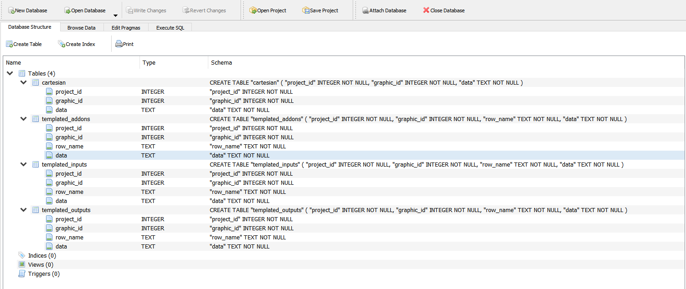

## SQLITE3 Database for PHP

Lies here is the sqlite3 database for php

```php

$connectionParams = array(
    'path' => '/home/project/database/power_distribution_box.db',
    'user' => 'admin',
    'password' => 'admin',
    'host' => 'localhost',
	'driver' => 'pdo_sqlite',
	'memory' => FALSE
);

$conn = \Doctrine\DBAL\DriverManager::getConnection($connectionParams);

```


